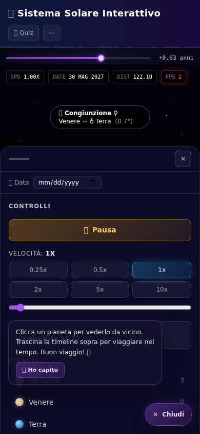
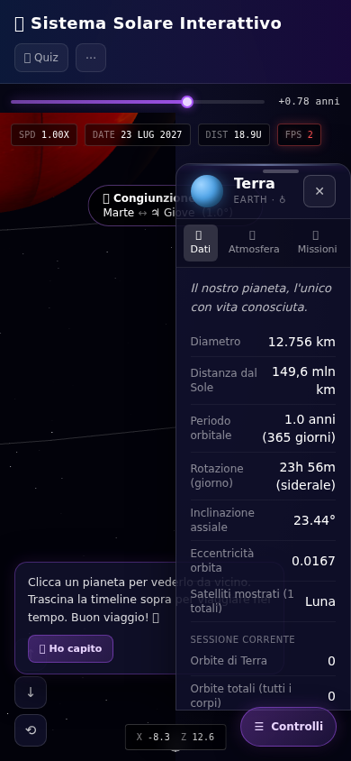
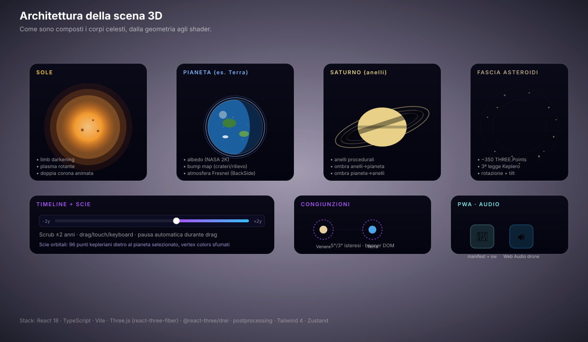

# 🌌 Sistema Solare Interattivo

Una simulazione interattiva del sistema solare costruita con **React 19**, **TypeScript**, **Vite 6** e **Tailwind CSS 4**: otto pianeti in orbita attorno al Sole con fisica keplariana reale, texture NASA, 12 lune, fasce degli asteroidi e di Kuiper, effemeridi Ω/ω J2000, modalità "scala reale 1:1", ombre/eclissi, screenshot mode, modalità mobile responsive e strumenti educativi (quiz e confronto).

## 🖼️ Galleria

### Vista principale (desktop)


Otto pianeti in orbita keplariana attorno al Sole, timeline interattiva in alto, sidebar controlli laterale, header compatto con chip toggle (Etichette, Realismo, Eclissi, Scala reale, FX, Quiz, Foto, Audio), banner congiunzione.

### Modalità realismo + eclissi


Texture NASA 2K, 12 lune orbitanti (Terra, Marte×2, Giove×4, Saturno×2, Urano, Nettuno), anelli di Urano (tilt 98°, "rotolamento") e Nettuno (5 archi sottili), fascia asteroidi con colori spettrali realistici (C/S/M type). Eclissi ON: shadow map che proiettano la Luna sulla Terra.

### Pannello informativo pianeta


Quattro tab (Dati / Atmosfera / Missioni / Curiosità), statistiche live: orbite completate nella sessione, composizione atmosfera, missioni spaziali, drag-and-drop per riposizionare. Linea scan "strumentazione di bordo" ogni 6s.

### Confronto pianeti


Selettori dropdown, tabella con righe comparative (diametro, distanza, periodo, lune, temperatura), valore maggiore in verde, scale comparative animate.

### Quiz spaziale


Domande a risposta multipla generate dal dataset. Counter "Prossima domanda →" alla fine di ogni step.

### Mobile: scena a tutto schermo + FAB


Su mobile (< 1024px) la sidebar si chiude in una bottom sheet richiamabile col FAB "☰ Controlli". La scena 3D occupa tutto lo schermo. Chip secondari (Etichette, Realismo, Eclissi, Scala reale, FX) si nascondono sotto 640px e confluiscono nel menu "⋯".

### Mobile: bottom sheet controlli



Sheet dal basso con play/pausa, slider velocità, data, lista pianeti scrollabile, scorciatoie tastiera nascoste (non utili su touch).

### Mobile: pannello info come bottom sheet



Il pannello diventa una bottom sheet full-width con grab bar, nessun drag-to-reposition (non ha senso su schermo stretto), max-h 72dvh.

### Architettura della scena 3D



Scomposizione dei componenti visivi: Sole (limb darkening + corona), Pianeti (albedo + atmosfera Fresnel + nubi shader Terra/Venere), Lune (12 sfere illuminate dal pointLight), Saturno/Urano/Nettuno (anelli), Asteroid belt (Points con colori C/S/M), Kuiper belt, Timeline, Congiunzioni, PWA + Audio.

> Gli screenshot in `docs/images/` sono generati automaticamente dallo script [`scripts/screenshots.mjs`](scripts/screenshots.mjs) (richiede Playwright). I mockup SVG in `docs/mockups/` sono statici e illustrativi.

## ✨ Funzionalità

### Simulazione orbitale
- **Fisica di Keplero**: orbite ellittiche con eccentricità reale, equazione di Keplero risolta per iterazione di Newton (`src/utils/kepler.ts`)
- **Velocità variabile**: preset 0.25x–10x + slider continuo 0,1x–20x
- **Posizioni per data**: picker per calcolare dove si trovavano i pianeti in una data specifica (epoca J2000)
- **Effemeridi Ω/ω (4.9)**: longitudine del nodo ascendente e argomento del perielio J2000 per ogni pianeta, orbite ruotate correttamente nel piano dell'eclittica
- **Scie orbitali**: trail dietro ai pianeti selezionati (96 punti, 60s di sim, vertex colors sfumati)
- **Timeline interattiva**: scrubber drag/touch/keyboard ±2 anni, pausa automatica durante drag
- **Fascia asteroidi** (~350) e **Fascia di Kuiper** (~120 TNO) come `THREE.Points` con rotazione propria, inclinazione orbitale e **colori spettrali realistici (4.7)**: C-type scuri (~75%), S-type chiari (~15%), M-type metallici (~5%)
- **Cometa decorativa** con orbita eccentrica e coda orientata dinamicamente opposta al Sole
- **Congiunzioni**: rilevamento automatico della coppia di pianeti più stretta, banner DOM e marker 3D con isteresi (5°/3°)

### Lune orbitanti (4.1)
- **12 lune** rese come sfere 3D illuminate dal pointLight del Sole → mostrano naturalmente il terminatore
- Luna (Terra), Phobos + Deimos (Marte), Io + Europa + Ganimede + Callisto (Giove), Titano + Encelado (Saturno), Titania (Urano), Tritone (Nettuno)
- Periodo orbitale in "secondi di simulazione" (coerente con slow-mo cinematografica)

### Scala reale 1:1 (4.8)
- Toggle "📏 Scala reale" wirato completamente: distanze in AU lineari (Mercurio a 0.2 unità, Nettuno a 15)
- Diametri 1:1 proporzionali ai km reali (Giove 11.2× Terra)
- Disclaimer "i pianeti interni sono punti quasi invisibili" quando attivo

### Eclissi / Shadow map (4.5)
- Toggle "🌑 Eclissi" in header (default OFF — shadow map 1024×1024 hanno costo GPU)
- PCFSoftShadowMap: la Luna proietta ombra sulla Terra e viceversa durante un'eclissi
- `castShadow + receiveShadow` su tutti i pianeti e le lune

### Grafica 3D
- **Texture NASA 2K** per albedo (CC-BY 4.0) per i 9 pianeti principali
- **Atmosfere Fresnel** (sphere BackSide + shader) su Venere, Terra, Giove, Saturno, Urano, Nettuno
- **Nubi procedurali (4.3)**: layer mesh separato per Terra (texture NASA `earth_clouds.png`) e Venere (texture generata al volo con swirl sinusoidali, in `utils/proceduralTextures.ts`)
- **Rotazione assiale** con inclinazione reale (es. Urano 97,77°, Venere retrograda 177,4°)
- **Anelli di Saturno** con texture NASA + **anelli procedurali per Urano (4.4)** (tilt 98° "rotolamento", fascia quasi verticale) **e Nettuno** (5 archi sottili Adams/Le Verrier/Galle/Arago/Lassell)
- **Sole** con limb darkening, plasma, macule, doppia corona
- **Congiunzioni**: rilevamento automatico della coppia di pianeti più stretta, banner DOM e marker 3D
- **Rotazione assiale visibile** proporzionale a `simRate × 360 / rotationHours` (ogni pianeta ruota alla sua velocità reale, scalata dalla velocità di simulazione)

### Interattività
- **Zoom & pan**: rotellina, drag, pinch (touch)
- **Free Cam mode**: chip dedicato per orbita illimitata
- **Pannello informativo espandibile**: composizione atmosferica, temperature, lune, missioni, curiosità, mission log live
- **⚖️ Confronto**: seleziona due pianeti e confronta diametro, distanza, periodo, lune, temperatura
- **🧠 Quiz**: domande a risposta multipla generate dai dati reali
- **📷 Screenshot mode (4.11)**: bottone + tasto `S` → `canvas.toDataURL()` + Web Share API su mobile + flash 200ms
- **🔊 Audio**: drone spaziale sintetizzato via Web Audio API (no download)
- **📍 Oggi**: torna alla data corrente dopo aver scelto una data
- **📏 Scala reale**: toggle 1:1 con disclaimer
- **🌑 Eclissi**: shadow map per eclissi Terra-Luna
- Etichette pianeti attivabili/disattivabili
- **Tour guidato** cinematico (panoramica → Terra → Saturno) con tween 1.8s

### Mobile / Responsive (S5)
- **Bottom sheet controlli** su < 1024px (FAB "☰ Controlli" in basso a destra con safe-area)
- **Header compatto** sotto 640px: chip secondari confluiscono nel menu "⋯" con stato attivo
- **Pannello info → bottom sheet** full-width con grab bar (no drag su mobile)
- **Date picker** spostato nella sheet su mobile
- **Touch & safe-area**: target touch ≥ 44px su `pointer: coarse`, `env(safe-area-inset-*)`, pinch del browser disattivato (conflitto con OrbitControls)
- **Performance tier mobile**: dpr [1, 1.25] vs [1, 1.75] desktop, fasce ridotte (200/70 vs 350/120), post-processing off di default

### PWA & offline
- **Manifest** + icone SVG (192/512)
- **Service worker** con strategia network-first per HTML e cache-first per asset
- Installabile su desktop e mobile

### Accessibilità & UX
- Navigazione da tastiera: `Spazio` pausa · `←`/`→` velocità · `↑`/`↓` tilt · `+`/`−` tilt · `R` reset · `T` reset tilt · `S` screenshot · `Esc` chiudi · `Home` reset timeline
- Ruoli ARIA (`dialog`, `button`, `aria-pressed`) e focus management
- `prefers-reduced-motion` rispettato (animazioni disattivate, scan line spenta)
- **Design system** centralizzato (`src/index.css`): token CSS, superficie `glass` condivisa, slider/chip/timeline coerenti
- Onboarding tip al primo avvio (persistito, posizionato adattivamente mobile/desktop)
- Cinematic transitions: fly-to 1.2s, intro flythrough 3s, slow-mo 0.25× automatico su select
- Bloom + Vignette post-processing (toggle "FX")

## 🛠️ Stack tecnologico

| | |
|---|---|
| Framework | React 19 + TypeScript 5 |
| Build | Vite 6 |
| 3D | Three.js 0.169 + @react-three/fiber 9 + @react-three/drei 10 + @react-three/postprocessing 3 |
| Styling | Tailwind CSS 4 + CSS custom (animazioni, shader, mobile sheet) |
| State | Zustand 5 + custom hooks |
| PWA | Service worker + manifest |
| Test | Vitest 4 + Testing Library 16 + jsdom 30 (180 test) |
| Qualità | ESLint 10, Prettier, TypeScript-ESLint 8, GitHub Actions CI |
| Screenshot docs | Playwright (script `scripts/screenshots.mjs`) |

## 📦 Avvio rapido

```bash
npm install        # installa le dipendenze
npm run dev        # server di sviluppo (http://localhost:5173)
npm run build      # typecheck + build di produzione in dist/
npm run preview    # anteprima della build di produzione
```

### Script utili

```bash
npm test              # suite Vitest (unit + integrazione, 180 test)
npm run test:coverage # coverage dei test
npm run lint          # ESLint
npm run format        # Prettier --write
npm run typecheck     # tsc --noEmit
```

### Rigenerare gli screenshot

```bash
npm i -D playwright && npx playwright install chromium --with-deps
npm run build && npm run preview &   # serve dist/ su :4173
node scripts/screenshots.mjs         # scrive docs/images/*.png
```

## 🔄 CI/CD

Ogni push/PR esegue il workflow [`.github/workflows/ci.yml`](.github/workflows/ci.yml): **Prettier check → Typecheck → ESLint → Vitest → Build**, con caricamento dell'artifact `dist/`.

## 🚀 Deploy su Vercel

### Opzione 1: Deploy diretto da GitHub (consigliata)

1. Carica il progetto su GitHub
2. Su [vercel.com](https://vercel.com) → **Add New Project** → importa il repository
3. Vercel rileva automaticamente Vite (config in `vercel.json`)
4. Clicca **Deploy**

### Opzione 2: Vercel CLI

```bash
npm install -g vercel
vercel          # preview
vercel --prod   # produzione
```

## 📁 Struttura del progetto

```
├── index.html                 # HTML entry point + PWA bootstrap + viewport mobile
├── public/
│   ├── sw.js                  # Service worker (network-first HTML, cache-first asset)
│   ├── manifest.webmanifest   # PWA manifest
│   ├── icon-*.svg             # Icone PWA
│   └── textures/planets/      # Texture NASA 2K (CC-BY 4.0) per albedo
├── src/
│   ├── main.tsx               # React entry point
│   ├── App.tsx                # Composizione scena + header + timeline + bottom sheet
│   ├── index.css              # Design tokens, mobile sheet, FAB, target touch
│   ├── components/
│   │   ├── PlanetInfoPanel.tsx# Pannello informazioni (bottom sheet su mobile)
│   │   ├── ControlsSidebar.tsx# Play/pausa, velocità, data, lista pianeti
│   │   ├── CompareModal.tsx   # Confronto tra due pianeti
│   │   ├── QuizModal.tsx      # Quiz a risposta multipla
│   │   ├── IntroOverlay.tsx   # Title sequence cinematografica
│   │   ├── Timeline.tsx       # Scrubber interattivo del tempo di simulazione
│   │   ├── OnboardingTip.tsx  # Tip primo avvio (persistito, adattivo mobile)
│   │   ├── ConjunctionBanner.tsx # Banner DOM per congiunzioni
│   │   ├── AmbientAudio.tsx   # Drone spaziale via Web Audio API
│   │   └── HoverCrosshair.tsx # Mirino + coordinate 3D world
│   ├── scene/
│   │   ├── SolarScene.tsx     # Wrapper <Canvas> r3f 9 + tier performance mobile
│   │   ├── Bodies.tsx         # Pianeti 3D, nubi, atmosfere Fresnel, rotazione assiale
│   │   ├── Sun3D.tsx          # Sole 3D con corona + limb darkening
│   │   ├── SaturnRings.tsx    # Anelli Saturno (texture NASA) + Ω
│   │   ├── PlanetRings.tsx    # Anelli Urano + Nettuno procedurali + Ω
│   │   ├── Moons.tsx          # 12 lune orbitanti con Ω del pianeta genitore
│   │   ├── AsteroidBelt3D.tsx # ~350 asteroidi, colori spettrali C/S/M, Ω 75°, realScale
│   │   ├── KuiperBelt3D.tsx   # ~120 TNO come Points, Ω 100°, realScale
│   │   ├── Comet3D.tsx        # Cometa con coda orientata dal Sole
│   │   ├── OrbitTrails.tsx    # Scie orbitali pianeti selezionati
│   │   ├── Conjunctions.tsx   # Rilevamento + marker 3D
│   │   ├── Orbits.tsx         # Orbite ellittiche con Ω J2000
│   │   ├── CameraRig.tsx      # OrbitControls + tilt + free camera
│   │   ├── CameraAnimator.tsx # Cinematic fly-to + intro flythrough
│   │   ├── CameraTracker.tsx  # Distanza/FPS ref live dentro Canvas
│   │   ├── TourController.tsx # Tour guidato
│   │   ├── HoverRaycaster.tsx # Raycast mouse per hover/selezione
│   │   ├── PostProcessing.tsx # Bloom + Vignette
│   │   ├── Lighting.tsx       # Ambient + pointLight + shadow map (eclissi)
│   │   ├── LoadingProvider.tsx# Ponte Canvas↔DOM per useProgress
│   │   ├── TelemetryHUD.tsx   # SPD / DATE / DIST / FPS
│   │   ├── Easing.ts          # easeInOutCubic etc.
│   │   ├── bodies3d.ts        # Manifest texture/distanze NASA + Ω/ω + REAL_SCALE_FACTOR
│   │   └── OrbitEngineBridge.tsx # Context per positionsRef/simTimeRef
│   ├── hooks/
│   │   ├── useOrbitEngine.ts  # Motore rAF + seekTo + slowmo
│   │   ├── useOrbitCounters.ts# Contatore orbite completate
│   │   └── useMedia.ts        # useMediaQuery + useIsMobile (layout reattivo)
│   ├── utils/
│   │   ├── kepler.ts          # Equazione di Keplero, anomalie, effemeridi
│   │   ├── simDate.ts         # Coerenza data → sim (anglesForDate, anomaliesForDate)
│   │   ├── format.ts          # Formattazione numeri/date it-IT
│   │   ├── prefs.ts           # usePersistentState + PREFS_KEYS
│   │   ├── random.ts          # PRNG mulberry32
│   │   └── proceduralTextures.ts # Nubi Venere, anelli Urano/Nettuno (CanvasTexture)
│   ├── data/
│   │   └── planets.ts         # Dataset pianeti (incluse Ω, ω, 12 lune)
│   └── store/
│       └── ui.ts              # Zustand store
├── scripts/
│   ├── screenshots.mjs        # Generazione screenshot con Playwright
│   └── make-saturn-rings.cjs  # Generatore saturn_rings.png procedurale
├── docs/
│   ├── FEATURES.md            # Descrizione tecnica di ogni feature
│   ├── MOCKUPS.md             # Note sui mockup SVG
│   ├── UI-UX-REVIEW.md        # Review UI/UX del progetto (S1–S4)
│   ├── MOBILE-UX.md           # Sprint S5 (mobile) + S6 (realismo 3D) + roadmap
│   ├── images/                # Screenshot PNG del README (Playwright)
│   └── mockups/               # Mockup SVG statici
├── .github/workflows/ci.yml   # Pipeline CI
└── vercel.json                # Configurazione Vercel (incluso service worker)
```

## 🪐 Dataset dei pianeti

| Pianeta | Diametro | Distanza dal Sole | Periodo orbitale | Lune | Eccentricità | Inclinazione assiale | Ω (J2000) | ω (J2000) |
|---------|----------|-------------------|------------------|------|--------------|----------------------|-----------|-----------|
| Mercurio | 4.879 km | 57,9 mln km | 88 giorni | 0 | 0,2056 | 0,03° | 48,33° | 29,12° |
| Venere | 12.104 km | 108,2 mln km | 225 giorni | 0 | 0,0068 | 177,4° | 76,68° | 54,92° |
| Terra | 12.756 km | 149,6 mln km | 365 giorni | 1 | 0,0167 | 23,44° | 174,95° | 102,95° |
| Marte | 6.792 km | 227,9 mln km | 687 giorni | 2 | 0,093 | 25,19° | 49,56° | 286,50° |
| Giove | 142.984 km | 778,6 mln km | 4.333 giorni | 95 | 0,0489 | 3,13° | 100,46° | 273,85° |
| Saturno | 120.536 km | 1.433,5 mln km | 10.759 giorni | 146 | 0,0565 | 26,73° | 113,72° | 339,39° |
| Urano | 51.118 km | 2.872,5 mln km | 30.687 giorni | 28 | 0,0457 | 97,77° | 73,92° | 96,99° |
| Nettuno | 49.528 km | 4.495,1 mln km | 60.190 giorni | 16 | 0,0113 | 28,32° | 131,72° | 259,88° |

I dati completi (composizione atmosferica, temperature, missioni spaziali, curiosità) vivono in `src/data/planets.ts` e alimentano sia il pannello informativo sia il quiz. Tutti i pianeti sono validati in `src/data/planets.validate.test.ts` con tolleranza del 5% sui valori fisici reali.

## 📖 Documentazione

- [`docs/FEATURES.md`](docs/FEATURES.md) — descrizione tecnica di ogni feature con riferimenti al codice
- [`docs/MOCKUPS.md`](docs/MOCKUPS.md) — galleria dei mockup SVG e note tecniche
- [`docs/UI-UX-REVIEW.md`](docs/UI-UX-REVIEW.md) — review UI/UX del progetto (Sprint S1–S4)
- [`docs/MOBILE-UX.md`](docs/MOBILE-UX.md) — Sprint S5 (mobile responsive) + Sprint S6 (realismo 3D) + roadmap

## 📄 Licenza

Uso dimostrativo/educativo.
