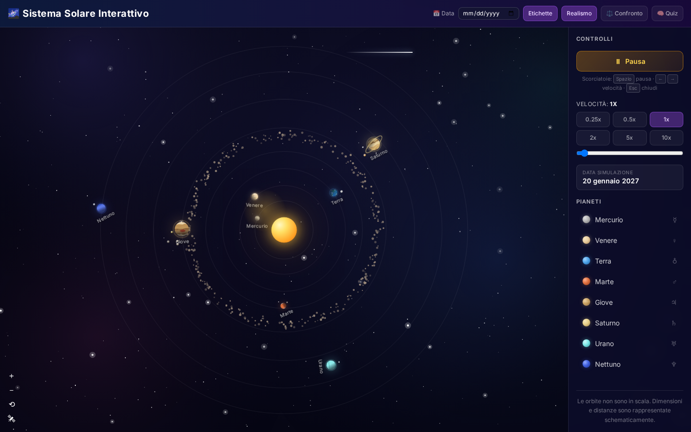
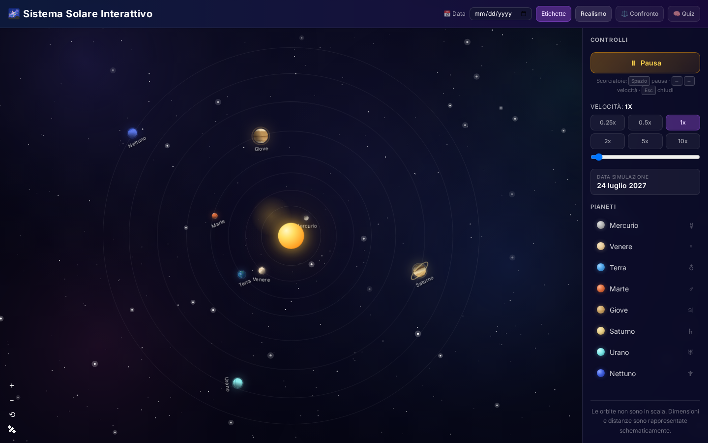
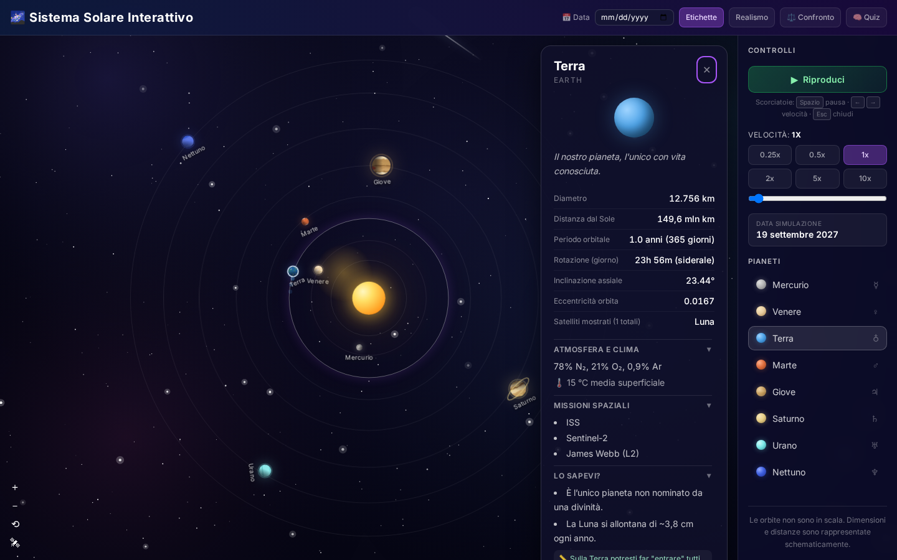
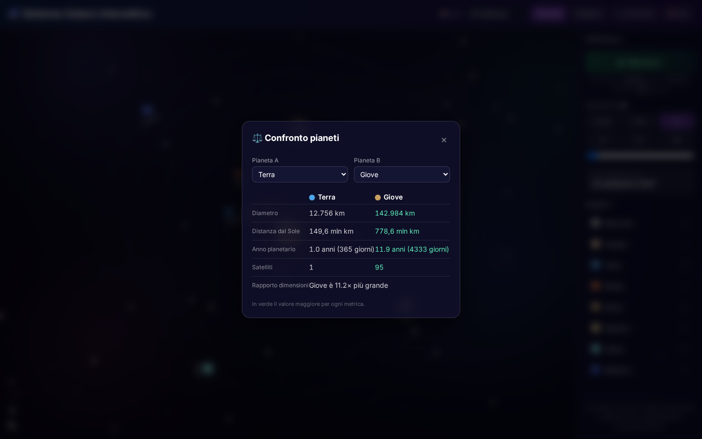
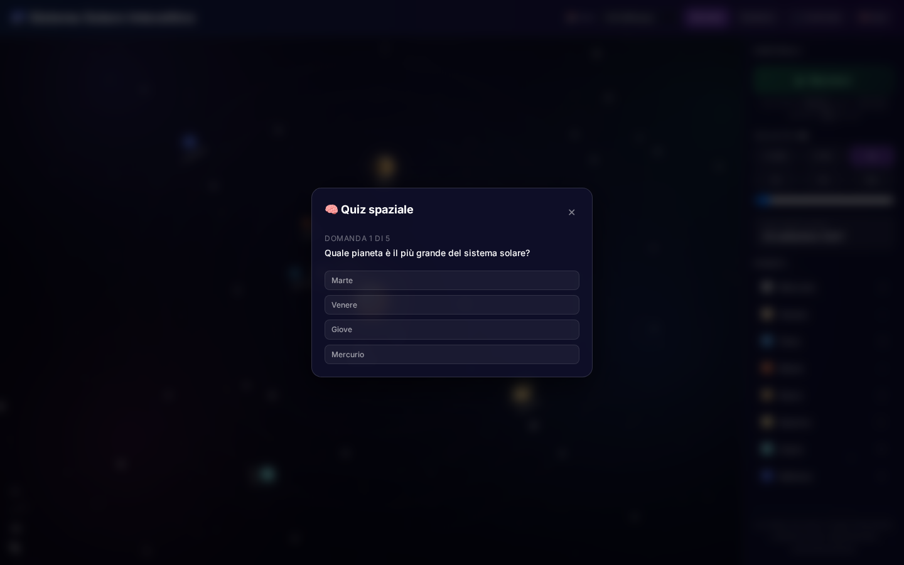
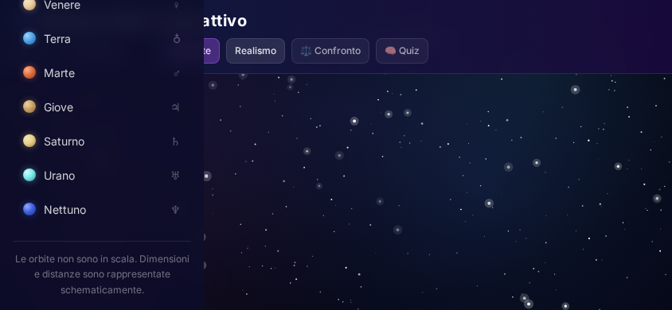

# 🌌 Sistema Solare Interattivo

Una simulazione interattiva del sistema solare costruita con **React 18**, **TypeScript**, **Vite** e **Tailwind CSS**: otto pianeti in orbita attorno al Sole con fisica keplariana, texture procedurali, satelliti naturali, fascia degli asteroidi e modalità educative (quiz e confronto).

## 📸 Screenshot

| Vista principale | Modalità "Realismo" |
|:---:|:---:|
|  |  |
| Orbite animate, Sole con corona e brillanzi, sfondo stellato | Texture procedurali, lune, fascia degli asteroidi |

| Pannello informativo | Confronto pianeti |
|:---:|:---:|
|  |  |
| Sezioni espandibili: atmosfera, temperatura, lune, missioni, curiosità | Metriche a barra e rapporti dimensionali tra due pianeti |

| Quiz mode | Layout mobile |
|:---:|:---:|
|  |  |
| Domande a risposta multipla generate dai dati del dataset | Interfaccia responsive su schermi piccoli |

> Gli screenshot sono generati automaticamente con Playwright: [`scripts/screenshots.mjs`](scripts/screenshots.mjs). Per rigenerarli: `npm run build && npm run preview` in un terminale, poi `node scripts/screenshots.mjs` in un altro.

## ✨ Funzionalità

### Simulazione orbitala
- **Fisica di Keplero**: orbite ellittiche con eccentricità reale, equazione di Keplero risolta per iterazione di Newton (`src/utils/kepler.ts`)
- **Velocità variabile**: preset 0.25x–10x + slider continuo 0,1x–20x
- **Posizioni per data**: picker per calcolare dove si trovavano i pianeti in una data specifica (epoca J2000)
- **Scie orbitali**: trail alle spalle dei pianeti selezionati o inseguiti
- **Fascia degli asteroidi**: ~200 asteroidi procedurali tra Marte e Giove (in modalità Realismo)

### Grafica
- **Texture procedurali** generate su canvas: crateri (Mercurio, Luna), nuvole (Venere, Terra, Giove), bande e Grande Macchia Rossa, poli ghiacciati — tutto senza asset esterni (`src/utils/textures.ts`)
- **Rotazione assiale** con inclinazione realistica (es. Urano 97,77°)
- **Effetti atmosferici** (glow) per Terra, Venere, Giove, Nettuno
- **Anelli di Saturno** semitrasparenti, **satelliti naturali** (Luna, Galileiani, Titano…)
- Corona solare pulsante, lens flare, cometa animata, sfondo stellato con nebulose

### Interattività
- **Zoom & pan**: rotellina del mouse, pulsanti dedicati, trascinamento della scena
- **Modalità follow 🛰**: la camera insegue il pianeta selezionato durante la rivoluzione
- **Pannello informativo espandibile**: composizione atmosferica, temperature, numero di lune, sonde spaziali inviate, curiosità
- **⚖️ Confronto**: seleziona due pianeti e confronta diametro, distanza, periodo orbitale, lune, temperatura
- **🧠 Quiz**: domande a risposta multipla generate in parte dai dati reali del dataset
- Etichette dei pianeti attivabili/disattivabili

### Accessibilità & UX
- Navigazione da tastiera: `Spazio` pausa · `←`/`→` velocità · `+`/`−` zoom · `Esc` chiudi
- Ruoli ARIA (`dialog`, `button`, `aria-pressed`) e focus management nei pannelli
- Design responsive desktop/mobile, micro-animazioni e stati hover

## 🛠️ Stack tecnologico

| | |
|---|---|
| Framework | React 18 + TypeScript 5 |
| Build | Vite 6 |
| Styling | Tailwind CSS 4 + CSS custom (animazioni, texture) |
| Test | Vitest + Testing Library + jsdom |
| Qualità | ESLint 10, Prettier, GitHub Actions CI |
| Screenshot docs | Playwright (script `scripts/screenshots.mjs`) |

## 📦 Avvio rapido

```bash
npm install        # installa le dipendenze
npm run dev        # server di sviluppo (http://localhost:5173)
npm run build      # typecheck + build di produzione in dist/
npm run preview    # anteprima della build di produzione
```

### Script utili

```bash
npm test              # suite Vitest (unit + integrazione)
npm run test:coverage # coverage dei test
npm run lint          # ESLint
npm run format        # Prettier --write
npm run typecheck     # tsc --noEmit
```

### Rigenerare gli screenshot

```bash
npm i -D playwright && npx playwright install chromium --with-deps
npm run build && npm run preview &   # serve dist/ su :4173
node scripts/screenshots.mjs         # scrive docs/images/*.png
```

## 🔄 CI/CD

Ogni push/PR esegue il workflow [`.github/workflows/ci.yml`](.github/workflows/ci.yml): **Prettier check → Typecheck → ESLint → Vitest → Build**, con caricamento dell'artifact `dist/`.

## 🚀 Deploy su Vercel

### Opzione 1: Deploy diretto da GitHub (consigliata)

1. Carica il progetto su GitHub
2. Su [vercel.com](https://vercel.com) → **Add New Project** → importa il repository
3. Vercel rileva automaticamente Vite (config in `vercel.json`)
4. Clicca **Deploy**

### Opzione 2: Vercel CLI

```bash
npm install -g vercel
vercel          # preview
vercel --prod   # produzione
```

## 📁 Struttura del progetto

```
├── index.html                 # HTML entry point
├── src/
│   ├── main.tsx               # React entry point
│   ├── App.tsx                # Scena, controlli header, zoom/pan/follow
│   ├── index.css              # Stili globali, animazioni, effetti
│   ├── components/
│   │   ├── Planet.tsx         # Pianeti: texture, atmosfera, lune, anelli
│   │   ├── Starfield.tsx      # Stelle e nebulose su canvas
│   │   ├── AsteroidBelt.tsx   # Fascia degli asteroidi procedurale
│   │   ├── ControlsSidebar.tsx# Play/pausa, velocità, data, pannello info
│   │   ├── PlanetInfoPanel.tsx# Pannello sezioni espandibili
│   │   ├── CompareModal.tsx   # Confronto tra due pianeti
│   │   └── QuizModal.tsx      # Quiz a risposta multipla
│   ├── hooks/
│   │   └── useOrbitEngine.ts  # Motore animazione (requestAnimationFrame)
│   ├── utils/
│   │   ├── kepler.ts          # Effemeridi, anomalie vere, orbite ellittiche
│   │   ├── textures.ts        # Texture planetarie procedurali
│   │   └── format.ts          # Formattazione numeri/date it-IT
│   └── data/
│       └── planets.ts         # Dataset: orbite, fisiche, lune, missioni
├── scripts/screenshots.mjs    # Generazione screenshot per la documentazione
├── docs/images/               # Screenshot del README
├── .github/workflows/ci.yml   # Pipeline CI
└── vercel.json                # Configurazione Vercel
```

## 🪐 Dataset dei pianeti

| Pianeta | Diametro | Distanza dal Sole | Periodo orbitale | Lune | Eccentricità | Inclinazione assiale |
|---------|----------|-------------------|------------------|------|--------------|----------------------|
| Mercurio | 4.879 km | 57,9 mln km | 88 giorni | 0 | 0,2056 | 0,03° |
| Venere | 12.104 km | 108,2 mln km | 225 giorni | 0 | 0,0068 | 177,4° |
| Terra | 12.756 km | 149,6 mln km | 365 giorni | 1 | 0,0167 | 23,44° |
| Marte | 6.792 km | 227,9 mln km | 687 giorni | 2 | 0,093 | 25,19° |
| Giove | 142.984 km | 778,6 mln km | 4.333 giorni | 95 | 0,0489 | 3,13° |
| Saturno | 120.536 km | 1.433,5 mln km | 10.759 giorni | 146 | 0,0565 | 26,73° |
| Urano | 51.118 km | 2.872,5 mln km | 30.687 giorni | 28 | 0,0457 | 97,77° |
| Nettuno | 49.528 km | 4.495,1 mln km | 60.190 giorni | 16 | 0,0113 | 28,32° |

I dati completi (composizione atmosferica, temperature, missioni spaziali, curiosità) vivono in `src/data/planets.ts` e alimentano sia il pannello informativo sia il quiz.

## 📄 Licenza

Uso dimostrativo/educativo.
