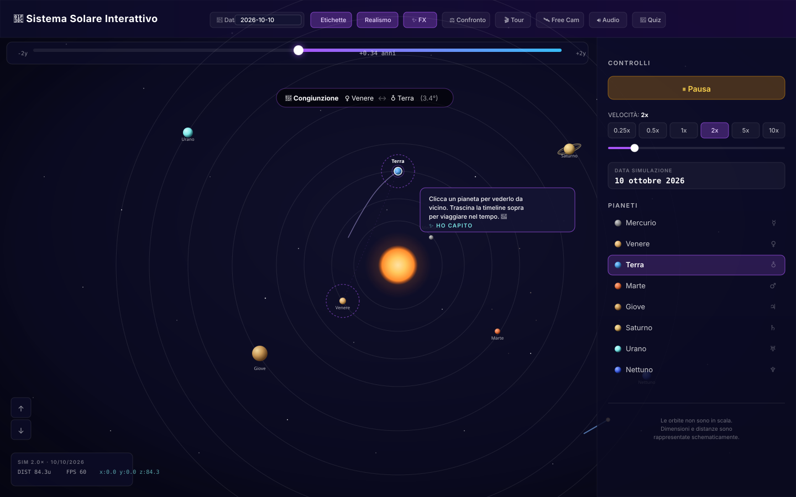
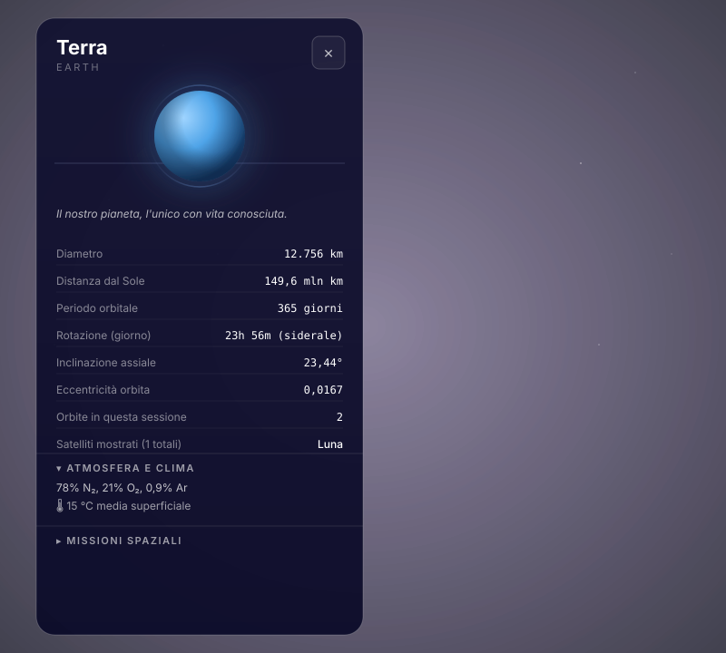
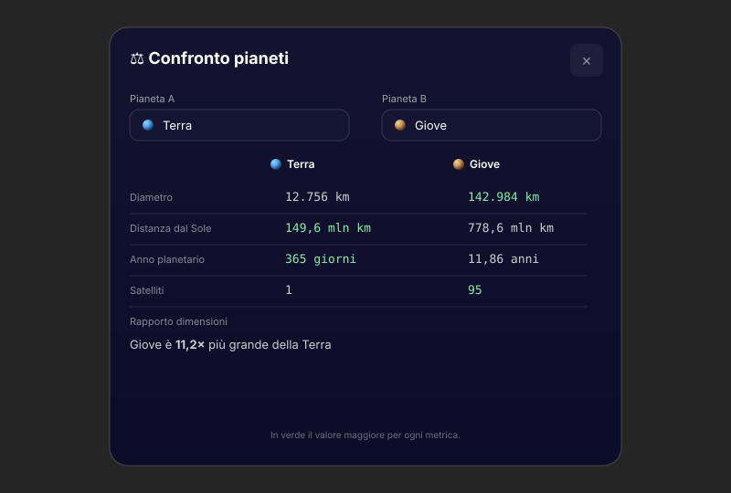
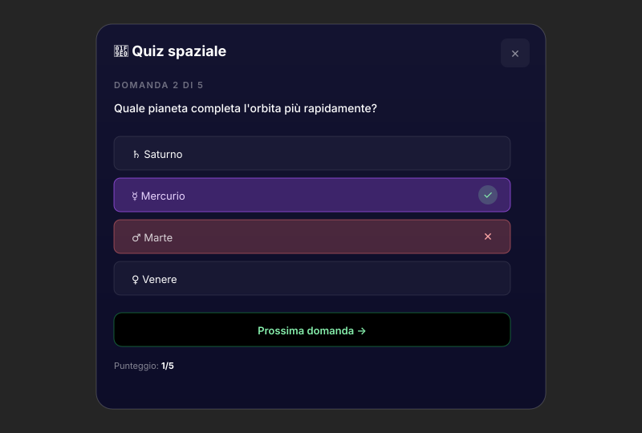
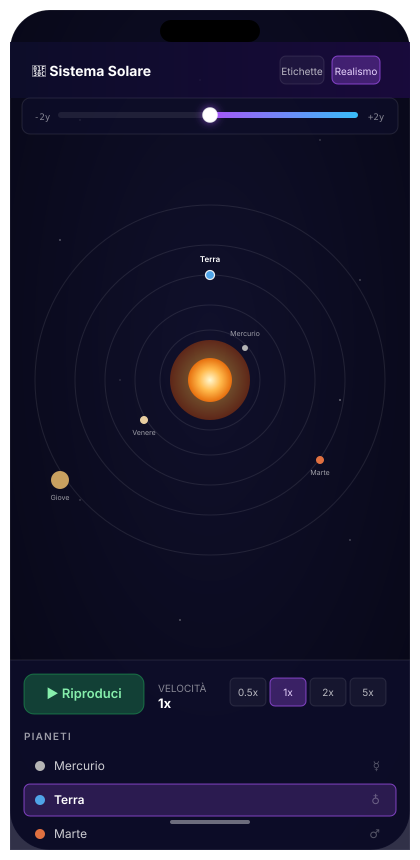

# 🎨 Mockup della UI

Mockup SVG statici ad alta risoluzione che documentano l'aspetto dell'applicazione. I file originali sono in [`docs/mockups/`](./mockups/); questa pagina li incorpora per la consultazione rapida.

## Vista principale

Mostra l'applicazione in stato "play" con la Terra selezionata, timeline attiva, banner di congiunzione Venere–Terra e tip di onboarding.



## Pannello informativo pianeta

Dettaglio del pannello "Terra" con sezioni espandibili per atmosfera, missioni e curiosità. Statistiche live: diametro, distanza, orbite completate, satellite mostrato.



## Confronto pianeti

Modalità "Confronto" con Terra vs Giove: dropdown, tabella comparativa, valore maggiore in verde, rapporto dimensionale.



## Quiz spaziale

Domanda 2/5 con opzioni shuffleate. Risposta corretta in verde, sbagliata in rosso. Pulsante "Prossima domanda →" abilitato dopo la selezione.



## Layout mobile (iPhone mockup)

Header compatto, timeline a tutta larghezza, sidebar collassata in basso con play/velocità e lista pianeti scrollabile.



## Architettura della scena 3D

Scomposizione visiva dei layer: Sole (corona), Pianeta (albedo + bump + atmosfera), Saturno (anelli + ombre), Asteroidi (Points), Timeline + Scie, Congiunzioni, PWA + Audio.


## Note tecniche

I mockup sono **SVG vettoriali**: scalano a qualsiasi risoluzione, supportano `prefers-color-scheme` e sono < 50KB ciascuno. Sono generati a mano per riflettere fedelmente lo stato attuale dell'UI; per screenshot reali della scena 3D (che è animata), usare Playwright:

```bash
npm run build && npm run preview &
node scripts/screenshots.mjs
```

Gli screenshot Playwright finiscono in `docs/images/*.png` e sostituiscono automaticamente i mockup statici nel README quando vengono rigenerati.
